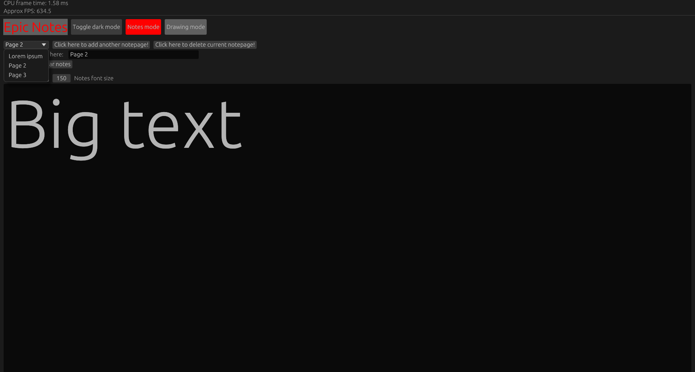
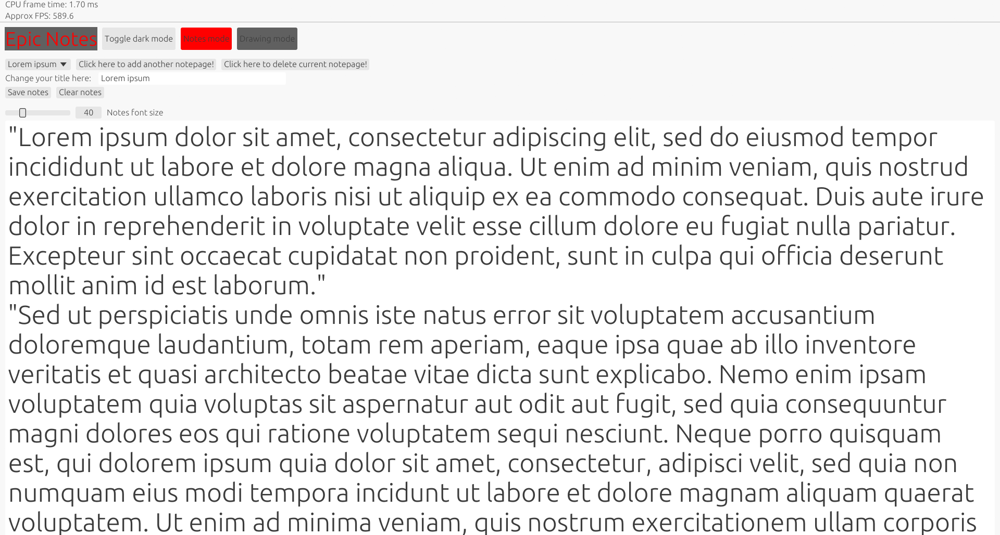
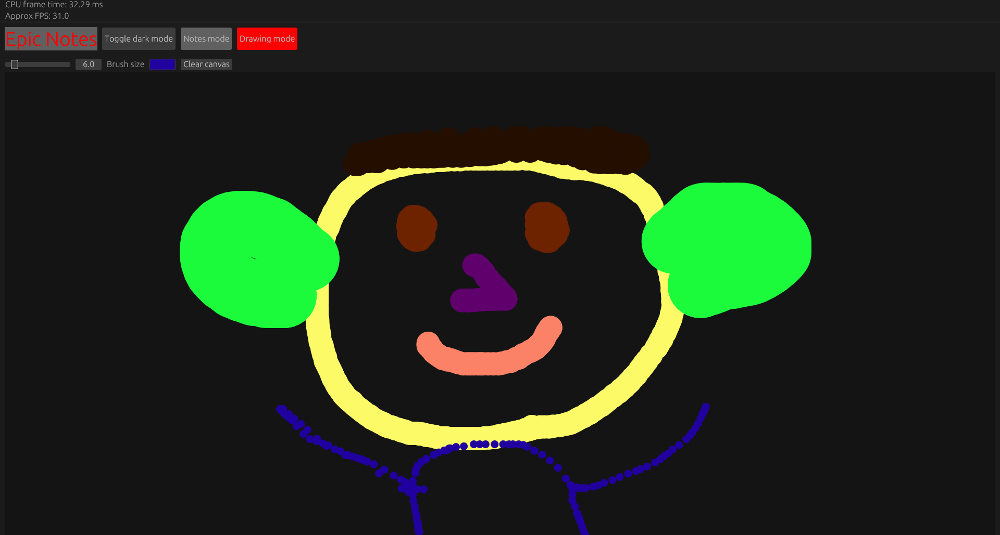

## Welcome to Epic Notes

Simple note-taking + drawing application built with egui in Rust. You can add as many note pages
as you want, along with deleting those pages, titling them what you want, changing font size, and saving
notes to a text file. You can also change the theme of the app and draw simple things with any colors
and any size brush you want.

## Photos of application

